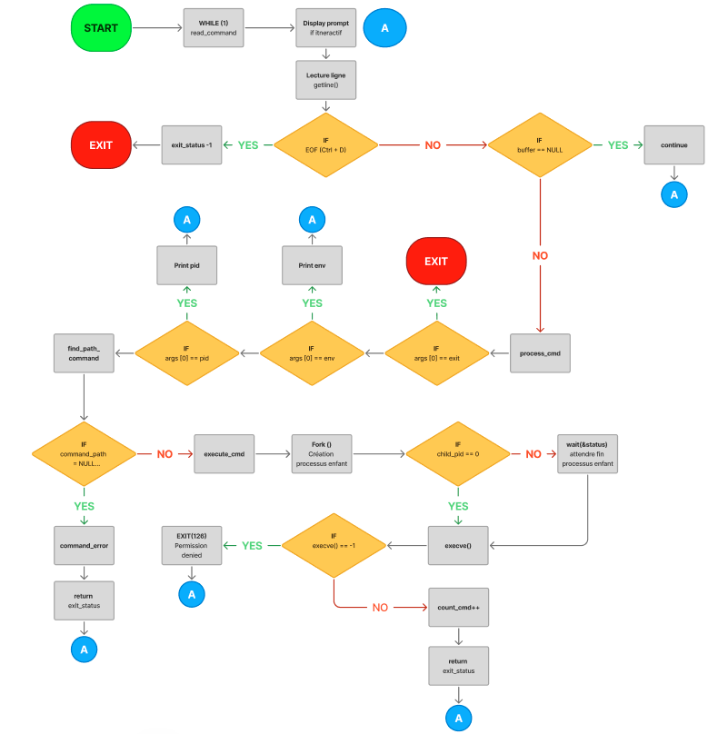
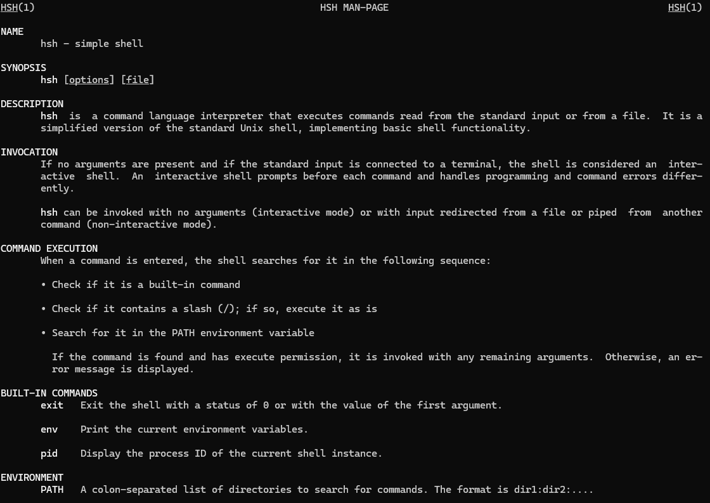
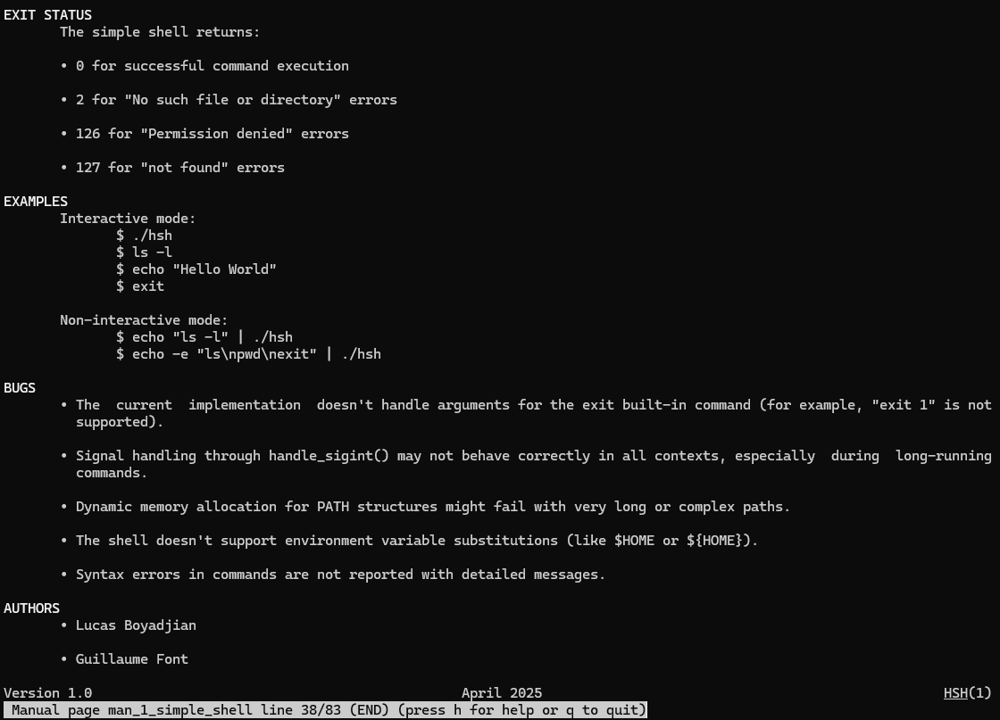

# Simple Shell

## Description

This Simple Shell project is a command line interpreter that provides a user interface to access operating system services. It implements basic functionalities including command execution, PATH handling, built-in commands (`exit`, `env`, `pid`), and signal handling (Ctrl+C).

## Requirements

### Compiler
* GCC 4.8.4 or later
* Compilation flags: -Wall -Werror -Wextra -pedantic -std=gnu89

### Authorized functions
* `all functions from string.h`
* `access`
* `chdir`
* `close`
* `closedir`
* `execve`
* `exit`
* `_exit`
* `fflush`
* `fork`
* `free`
* `getcwd`
* `getline`
* `getpid`
* `isatty`
* `kill`
* `malloc`
* `open`
* `opendir`
* `perror`
* `printf`
* `fprintf`
* `vfprintf`
* `sprintf`
* `putchar`
* `read`
* `readdir`
* `signal`
* `stat`
* `lstat`
* `fstat`
* `strtok`
* `wait`
* `waitpid`
* `wait3`
* `wait4`
* `write`

## Compilation

```bash
gcc -Wall -Werror -Wextra -pedantic -std=gnu89 *.c -o hsh
```

## Return Value

The Simple Shell returns:
- `0` for successful command execution
- `2` for "No such file or directory" errors
- `126` for "Permission denied" errors
- `127` for "not found" errors
- The exit code provided to the `exit` command

## Usage Examples

### Interactive Mode

```bash
$ ./hsh
$ ls -l
total 48
-rw-r--r-- 1 user user  1280 Apr 21 15:33 builtin.c
-rw-r--r-- 1 user user  5310 Apr 21 15:33 cmd.c
-rw-r--r-- 1 user user  3535 Apr 21 15:33 env.c
-rwxr-xr-x 1 user user 22744 Apr 21 15:40 hsh
-rw-r--r-- 1 user user  5216 Apr 21 15:33 path.c
-rw-r--r-- 1 user user  1599 Apr 21 15:33 parser.c
-rw-r--r-- 1 user user  1095 Apr 21 15:33 README.md
-rw-r--r-- 1 user user  1093 Apr 21 15:33 shell.c
-rw-r--r-- 1 user user  1110 Apr 21 15:33 shell.h
-rw-r--r-- 1 user user   168 Apr 21 15:33 signal.c
$ echo hello world
hello world
$ /bin/ls
builtin.c  cmd.c  env.c  hsh  path.c  parser.c  README.md  shell.c  shell.h  signal.c
$ exit
```

### Non-Interactive Mode

The shell handles non-interactive mode through pipelines or input redirection:

```bash
$ echo "ls -l" | ./hsh
total 48
-rw-r--r-- 1 user user  1280 Apr 21 15:33 builtin.c
-rw-r--r-- 1 user user  5310 Apr 21 15:33 cmd.c
-rw-r--r-- 1 user user  3535 Apr 21 15:33 env.c
-rwxr-xr-x 1 user user 22744 Apr 21 15:40 hsh
-rw-r--r-- 1 user user  5216 Apr 21 15:33 path.c
-rw-r--r-- 1 user user  1599 Apr 21 15:33 parser.c
-rw-r--r-- 1 user user  1095 Apr 21 15:33 README.md
-rw-r--r-- 1 user user  1093 Apr 21 15:33 shell.c
-rw-r--r-- 1 user user  1110 Apr 21 15:33 shell.h
-rw-r--r-- 1 user user   168 Apr 21 15:33 signal.c
```

Multiple commands can be executed in sequence:

```bash
$ echo -e "ls\npwd\nexit" | ./hsh
builtin.c  cmd.c  env.c  hsh  path.c  parser.c  README.md  shell.c  shell.h  signal.c
/home/user/holbertonschool-simple_shell
```
## Project Files

| File        | Description                                                |
|-------------|------------------------------------------------------------|
| shell.c   | Main entry point of the shell with the main function       |
| shell.h   | Header file containing prototypes and structures           |
| cmd.c     | Functions to read, process and execute commands            |
| env.c     | Functions to manipulate environment variables              |
| path.c    | Functions to manage PATH and search for commands           |
| parser.c  | Functions to analyze and split strings                     |
| signal.c  | Signal handling functions (Ctrl+C)                         |
| builtin.c | Implementation of built-in commands like env and pid       |

## Prototypes

/* env.c - Environment variable functions */
char *_getenv(const char *name);
int find_env_index(const char *name);
int _setenv(const char *name, const char *value, int overwrite);
int _unsetenv(const char *name);
void print_env(void);

/* path.c - PATH handling functions */
path_node_t *build_path_list(void);
int print_path_list(const path_node_t *head);
int print_path_directories(void);
char *find_path_command(char *command);
void free_path_list(path_node_t *head);

/* cmd.c - Command processing functions */
ssize_t read_command(char **buffer, size_t *bufsize);
int execute_command(char *command_path, char **args, char *prog_name, int cmd_count);
int process_command(char *buffer, char *prog_name, int cmd_count);
int command_error(char **args, char *prog_name, int cmd_count);

/* parser.c - String parsing functions */
char **split_string(char *str);
int _which(char *filename);

/* signal.c - Signal handling functions */
void handle_sigint(int sig);

/* builtin.c - Built-in command functions */
int handle_builtin_env(char **args);
int handle_builtin_pid(char **args);

## Flowchart



## Man Page

To access the man-page for hsh, use the command: man ./$ man ./man_1_simple_shell




## Memory Leak Checking

To check for memory leaks, use Valgrind:

```bash
$ valgrind --leak-check=full --show-leak-kinds=all ./hsh
```

## Features

1. **Command Execution**:
   - Search for commands in PATH
   - Execute commands with arguments
   - Handle command errors appropriately

2. **Built-in Commands**:
   - `exit`: Exit the shell
   - `env`: Display environment variables
   - `pid`: Display process ID (bonus feature)

3. **Path Navigation**:
   - Find commands in any directory listed in PATH
   - Handle commands with full paths

4. **Signal Handling**:
   - Capture Ctrl+C (SIGINT)
   - Maintain shell operation when interrupted

5. **Mode Support**:
   - Interactive mode with prompt
   - Non-interactive mode for scripting and pipes

## Known Bugs

- The current implementation doesn't handle arguments for the `exit` built-in command
- There are some unused functions in the code that are reserved for future enhancements
- `print_env()` uses `printf()` instead of `write()`, which might cause buffering issues in certain situations
- Memory leaks might occur if the shell is terminated abruptly without proper cleanup

## Authors

[Lucas Boyadjian](https://github.com/Yadjian92) and [Guillaume Font](https://github.com/PoussPouss)